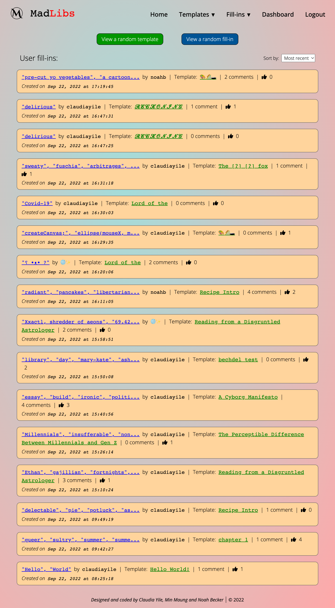
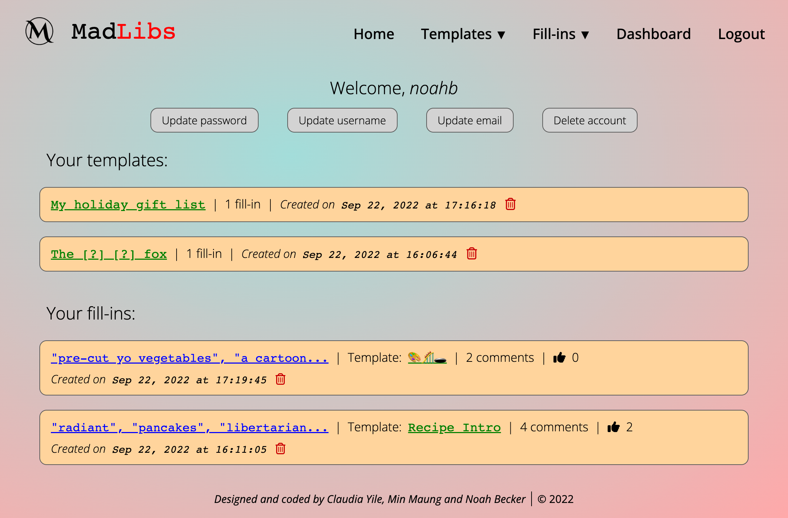
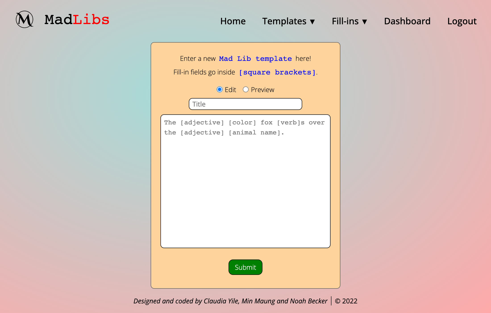
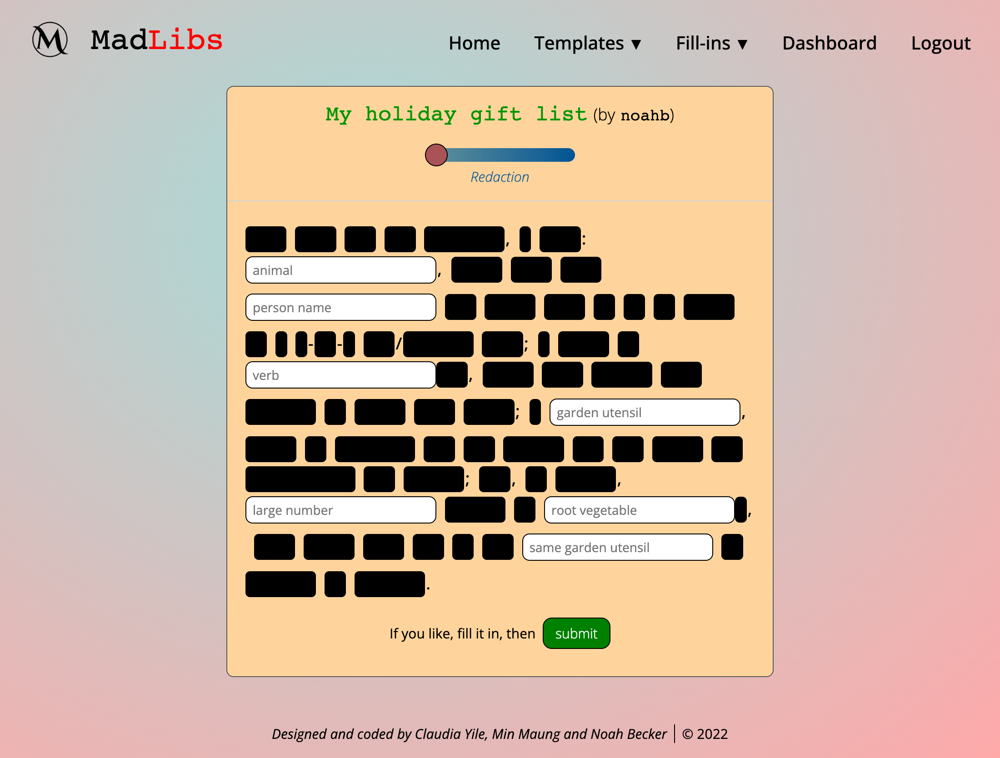
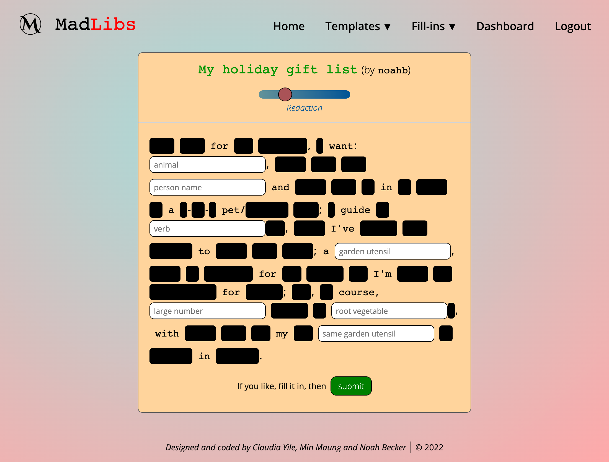
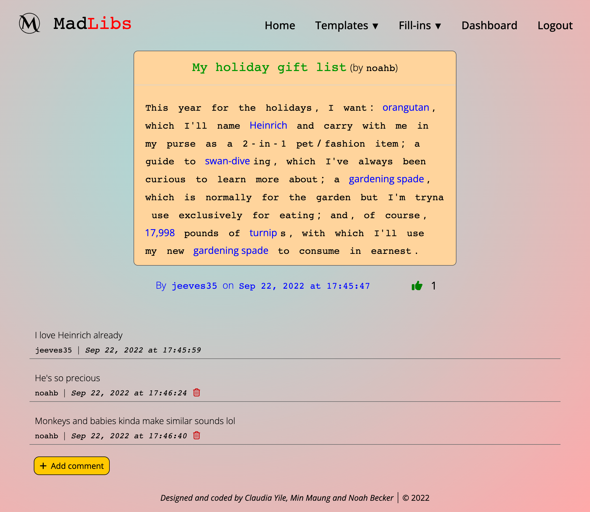

# Mad Libs

    

## Repo
[https://github.com/noah35becker/mad-libs](https://github.com/noah35becker/mad-libs)

## Live application
[https://morning-caverns-82636.herokuapp.com/](https://morning-caverns-82636.herokuapp.com/)

## Description
This application reimagines <b>Mad Libs</b>, the popular word game, in a browser-based forum/blog context. Users create an account from which they can make Mad Libs templates, fill in other user-generated templates, and comment/upvote on other users' fill-ins.

<i><b>
## Table of contents

- [Features](#features)
- [Credits](#credits)
- [Directions for future development](#directions-for-future-development)

- [Contributing](#contributing)
- [License](#license)
- [Questions](#questions)
- [Screenshots of deployed application](#screenshots-of-deployed-application)
</i></b>

## Features
- Adjustable <b>redaction</b> of Mad Libs templates (this really pops on screen!)
- <b>User accounts</b> (including account management)
- <b>Commenting</b> and <b>upvoting</b> user fill-ins
- <b>Template maker</b> interface
- Front-end <b>sorting</b> options for templates and fill-ins (most recent, upvotes, random)
- Buttons for viewing a <b>random</b> template or fill-in
- <b>Auto logout</b> after 15 minutes of user idleness (i.e. no page reloads)
- <b>Administrator access</b> with global delete privileges
- <b>Responsive design</b>, adapting to different viewports and devices

## Credits

### Collaborators
- Noah Becker ([GitHub](https://github.com/noah35becker))
- Claudia Yile ([GitHub](https://github.com/claudiayile))
- Min Maung ([GitHub](https://github.com/minmaung0307))

### Third-party assets
- [Node.js](https://nodejs.org/)
- [MySQL](https://www.mysql.com/)
- [Handlebars](https://handlebarsjs.com/) template engine
- Node packages: 
    - [Express](https://www.npmjs.com/package/express)
    - [MySQL2](https://www.npmjs.com/package/mysql2)
    - [Express Session](https://www.npmjs.com/package/express-session)
    - [Express Handlebars](https://www.npmjs.com/package/express-handlebars)
    - [Sequelize](https://www.npmjs.com/package/sequelize)
    - [Connect Session Sequelize](https://www.npmjs.com/package/connect-session-sequelize)
    - [Bcrypt](https://www.npmjs.com/package/bcrypt)
    - [Lodash](https://www.npmjs.com/package/lodash)
    - [Luxon](https://www.npmjs.com/package/luxon)
    - [Dotenv](https://www.npmjs.com/package/dotenv)
- [Heroku](https://www.heroku.com/)
- [JawsDB MySQL](https://devcenter.heroku.com/articles/jawsdb)

### Tutorials
- [RegEx tutorial #1](https://regexone.com/)
- [RegEx tutorial #2](https://towardsdatascience.com/regular-expressions-clearly-explained-with-examples-822d76b037b4)

## Directions for future development
- The <b>email</b> feature is only nominal at this time. It should be developed to actually include account management functionality, including account verification upon signup + account recovery.
- If <b>templates</b> aren't editable, then at least make them <b>duplicable</b>.
- Attach a <b>`new` tag</b> to fill-ins that have been created within the last 24 hours, to display as part of fill-in metadata.
- For fill-ins, change the word <b>'a'/'an'</b> accordingly when followed by a user fill-in word.
- On input, fill-ins could record a <b>`maxVisibilityOnInput`</b> value corresponding to the <b>maximum unredaction</b> with which the user viewed the template while filling it in, which could later be offered as a sort/filter parameter. The idea here is that filling out a template with full redaction leads to very different sorts of fill-ins than filling out a template with partial or no redaction.
- <b>Username and password validation</b> (minimum # of characters, required uppercase/lowercase/special characters, etc.) should be added.
- All screens that require a password should have the option to <b>show or hide</b> it while inputting.
- There are places on the application where it would be helpful to have the user <b>enter their password twice</b>.
- A <b>search</b> feature

## Contributing
Feel free to fork this project's [repo](https://github.com/noah35becker/mad-libs), contribute code, and submit pull requests [here](https://github.com/noah35becker/mad-libs/pulls)!

Contributors to this project must follow all guidelines set forth by the [Contributor Covenant](https://www.contributor-covenant.org/version/2/1/code_of_conduct/).

## License

Learn more about this license [here](https://choosealicense.com/licenses/mit).

## Questions
My GitHub username is [noah35becker](https://github.com/noah35becker).

If you have any questions, I'd be glad to hear from you—contact me at [noahbeckercoding@gmail.com](mailto:noahbeckercoding@gmail.com).

## Screenshots of deployed application

Below are screenshots of the application:
 
 

Home page
 

 
User dashboard

 
The template maker

 
A template, fully redacted

 
That same template, now in a state of partial unredaction

 
A fillin
